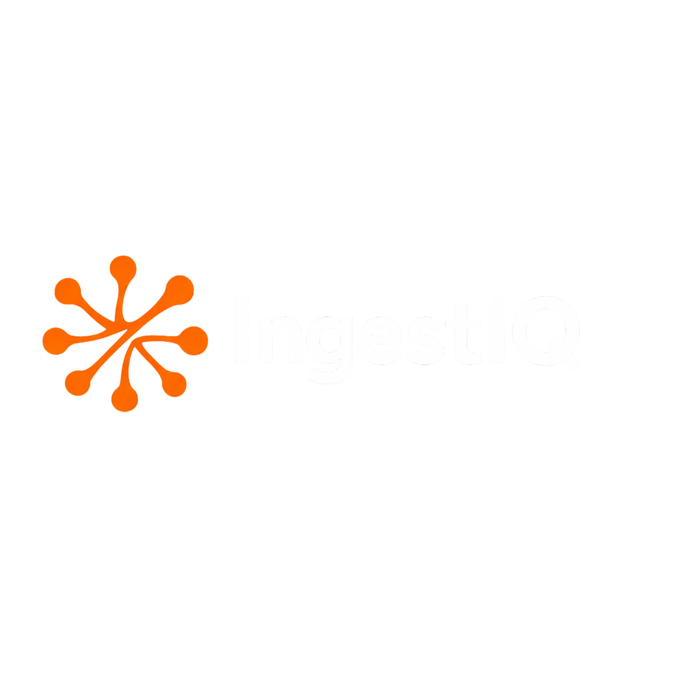

<div align="center">
  
  <p>
    <b>Agentic RAG as a Service Platform for Enterprises and Developers!</b>
  </p>
  <p>
    Document Parsing • Vector Storage • Multi-Tenant • Scalable Pipelines
  </p>
  <br />

  <a href="https://opensource.org/licenses/Apache-2.0">
    
  </a>
  <a href="https://github.com/avesta-hq/ingestiq-backend/actions/workflows/ci.yml">
    
  </a>
  <a href="CONTRIBUTING.md">
    
  </a>
   <a href="https://ingestiq.ai/">
    
  </a>

  <br />
  <br />

  <a href="https://x.com/avestalabs">
    
  </a>
  <a href="https://www.linkedin.com/company/avestalabs/">
    
  </a>
  <a href="https://www.youtube.com/channel/UCHCxoLxwAy1FCXkdch7Ex0Q">
    
  </a>

</div>

<br />

<div align="center">
  
</div>

<br />

## 🚀 Overview

**IngestIQ** is a comprehensive **RAG (Retrieval-Augmented Generation) platform** designed to help AI application developers easily integrate enterprise data sources into their applications without building RAG infrastructure from scratch.

> **Hosted Platform**: Check out our hosted solution at [IngestIQ Landing Page ↗](https://ingestiq-landing-page.vercel.app/)

## ✨ Features

IngestIQ provides a robust set of tools for your data pipelines:

| Core Capabilities | Data Connectors | Platform Features |
| :--- | :--- | :--- |
| **📄 Multi-format Processing**<br>PDF, CSV, Excel, and Video | **📂 File Upload**<br>Direct file ingestion | **🗂️ Knowledge Bases**<br>Organized searchable collections |
| **🧩 Smart Chunking**<br>Semantic chunking with LLMs | **🕸️ Web Scraping**<br>Advanced crawling with Crawl4AI | **⚡ Pipelines**<br>Configurable workflows & scheduling |
| **🧠 Vector Database**<br>Supported PGVector, Pinecone, Qdrant, Milvus, MongoDB Atlas | **📹 Video Processing**<br>YouTube & URL transcription | **🔌 MCP Server**<br>Model Context Protocol integration |
| **🔍 Metadata Filtering**<br>Precise retrieval options | **☁️ Google Drive**<br>OAuth2 dynamic ingestion | **🛡️ Multi-tenant**<br>Organization support |


## Tech Stack

<div align="center">
  
  
  
  
  
  
  
</div>

## Getting Started

### Prerequisites

- Node.js 18+
- npm/yarn/pnpm

### Installation

```bash
# Install dependencies
npm install

# Start development server
npm run dev
```

Open [http://localhost:3000](http://localhost:3000) to view the site.

## Project Structure

```
├── app/                    # Next.js App Router pages
│   ├── docs/              # Documentation pages
│   ├── features/          # Feature pages
│   ├── solutions/         # Solution pages
│   └── layout.tsx         # Root layout
├── components/
│   ├── layout/            # Header, Footer, Navigation
│   ├── ui/                # Reusable UI components
│   └── providers/         # Context providers
├── ingestIqDocs/          # MDX documentation content
├── public/                # Static assets
└── lib/                   # Utility functions
```

## Available Scripts

| Command | Description |
|---------|-------------|
| `npm run dev` | Start development server |
| `npm run build` | Build for production |
| `npm run start` | Start production server |
| `npm run lint` | Run ESLint |

## Environment Variables

Create a `.env` file based on `.env.example`:

```env
# Email (Resend)
RESEND_API_KEY=your_resend_api_key
```

## Documentation

Documentation is written in MDX and located in `ingestIqDocs/`. The docs use Mintlify-style components like `<Card>`, `<CardGroup>`, and `<Accordion>`.


## 🤝 Community & Support

We'd love to hear from you!

- 🐦 [**Twitter/X**](https://x.com/avestalabs) - Follow for updates
- 💼 [**LinkedIn**](https://www.linkedin.com/company/avestalabs/) - Connect with us
- 📺 [**YouTube**](https://www.youtube.com/channel/UCHCxoLxwAy1FCXkdch7Ex0Q) - Watch tutorials
- 📧 [**Email**](mailto:admin@avestalabs.ai) - Contact support

